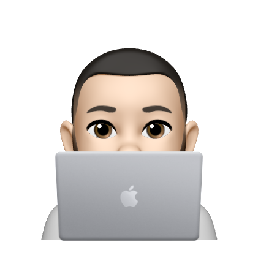

<!--
*** Thanks for checking out the Best-README-Template. If you have a suggestion
*** that would make this better, please fork the repo and create a pull request
*** or simply open an issue with the tag "enhancement".
*** Thanks again! Now go create something AMAZING! :D
***
***
***
*** To avoid retyping too much info. Do a search and replace for the following:
*** brianangulo, portfoliowebsite, BrianAngulo11, bangulo219@gmail.com, Brian's Portfolio, This is my personal portfolio website
-->


<!-- PROJECT SHIELDS -->
<!--
*** I'm using markdown "reference style" links for readability.
*** Reference links are enclosed in brackets [ ] instead of parentheses ( ).
*** See the bottom of this document for the declaration of the reference variables
*** for contributors-url, forks-url, etc. This is an optional, concise syntax you may use.
*** https://www.markdownguide.org/basic-syntax/#reference-style-links
-->

<!-- PROJECT LOGO -->
<br />
<p align="center">
  <a href="https://github.com/brianangulo/portfoliowebsite">
    
  </a>

  <h3 align="center">Brian's Portfolio</h3>

  <p align="center">
    This is my personal portfolio website
    <br />
    <br />
    <a href="https://www.brianangulo.com/">View Live</a>
    ·
    <a href="https://github.com/brianangulo/portfoliowebsite/issues">Report Bug</a>
    ·
    <a href="https://github.com/brianangulo/portfoliowebsite/issues">Request Feature</a>
  </p>
</p>


<!-- TABLE OF CONTENTS -->
<details open="open">
  <summary><h2 style="display: inline-block">Table of Contents</h2></summary>
  <ol>
    <li>
      <a href="#about-the-project">About The Project</a>
      <ul>
        <li><a href="#built-with">Built With</a></li>
      </ul>
    </li>
    <li>
      <a href="#getting-started">Getting Started</a>
      <ul>
        <li><a href="#installation">Installation</a></li>
      </ul>
    </li>
    <li><a href="#usage">Usage</a></li>
    <li><a href="#roadmap">Roadmap</a></li>
    <li><a href="#contact">Contact</a></li>
  </ol>
</details>


<!-- ABOUT THE PROJECT -->
## About The Project


### Built With

* [React.js](https://reactjs.org/)
* [Material UI](https://material-ui.com/)
* [Firebase](https://firebase.google.com/)
* [Node.js](https://nodejs.org/en/)


<!-- GETTING STARTED -->
## Getting Started

To get a local copy up and running follow these simple steps.

### Installation

1. Clone the repo
   ```sh
   git clone https://github.com/brianangulo/portfoliowebsite.git
   ```
2. Install NPM packages
   ```sh
   npm install
   ```
3. Start development server
   ```sh
   npm start
   ```


<!-- USAGE EXAMPLES -->
## Usage

This project including the contents of this readme are for my personal use.


<!-- ROADMAP -->
## Roadmap

See the [open issues](https://github.com/brianangulo/portfoliowebsite/issues) for a list of proposed features (and known issues).


<!-- CONTACT -->
## Contact

Your Name - [@BrianAngulo11](https://twitter.com/BrianAngulo11) - bangulo219@gmail.com

Project Link: [https://github.com/brianangulo/portfoliowebsite](https://github.com/brianangulo/portfoliowebsite)
